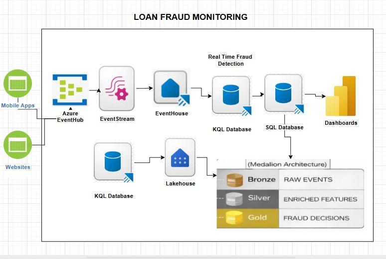

# 🏦 Real-Time Loan Fraud Detection Platform — Microsoft Fabric

An end-to-end cloud data engineering pipeline built entirely inside **Microsoft Fabric**, simulating how a bank detects fraudulent loan applications in real time. The project ingests multi-source banking data (customer profiles, loan applications, device telemetry, and credit bureau scores), warehouses it through a Medallion architecture (Bronze → Silver → Gold), and surfaces fraud and risk signals via a live Power BI dashboard.

> **Tech Stack:** Microsoft Fabric · KQL Database · Fabric Eventstream · Dataflows Gen2 · Fabric Data Pipelines · T-SQL · Python · Power BI DirectLake

---

## 📌 Business Problem

Banks receive thousands of loan applications daily across home, vehicle, and personal loan products. Compliance teams need to:

- Distinguish **genuine applications** from **fraudulent ones** in near real-time
- Identify **high-risk customers** based on credit bureau data
- Understand **device and channel patterns** that correlate with fraud
- Report findings to senior management through a live, self-serve dashboard

This project builds the full data platform to answer those questions — from raw event ingestion all the way to a Power BI report wired with Q&A natural language visuals.

---

## 🏛️ Architecture



The platform is built on a **Medallion-style layered architecture** inside Microsoft Fabric:

```
[Real-Time Event Source]  [External CSV (Credit Bureau)]
         │                            │
         ▼                            ▼
  KQL Database (Eventstream)    Lakehouse (Copy Data Activity)
         │                            │
         └──────────────┬─────────────┘
                        ▼
              STAGE Schema (RAW Layer)
         STG_CUSTOMER | STG_LOAN_APPLICATION
         STG_APPLICATION_DEVICE | STG_CREDIT_BUREAU
                        │
                        ▼  (Fabric Data Pipeline — Silver Load)
              BUSINESS Schema (SILVER Layer)
     DIM_CUSTOMER | DIM_CREDIT_PROFILE | DIM_DEVICE
     DIM_DATE | FACT_LOAN_APPLICATION
                        │
                        ▼  (SQL View Layer — Gold)
              VIEW_LAYER Schema (GOLD Layer)
     VW_LOAN_FRAUD_DETECTION_SUMMARY
     VW_RISKY_LOAN_APPLICATIONS
     VW_CUSTOMER_ACTIVE_LOANS
     VW_LOAN_APPLICATIONS_BY_DEVICE
     VW_LOAN_APPLICATIONS_BY_AGE_GROUP
                        │
                        ▼
     DirectLake Semantic Model ──► Power BI Dashboard
```

---

## 🗂️ Repository Structure

| File | Purpose |
|------|---------|
| `Stage_Tables_DDLs.sql` | DDLs for the RAW/staging schema (`STAGE.*`) |
| `Business_Table_DDLs.SQL` | DDLs for the Silver warehouse schema (`BUSINESS.*`) |
| `business_tables_loading.sql` | SQL scripts that move data from STAGE → BUSINESS |
| `Gold_Layer.sql` | All Gold-layer views (`VIEW_LAYER.*`) for reporting |
| `KQL_Queries.kql` | KQL queries used on the Eventstream ingestion database |
| `script_to_load_EventStream.py` | Python script that simulates/feeds loan application events into Eventstream |
| `Upper.py` | Python utility for string normalization (used during pipeline transformations) |
| `CREDIT_BUREAU_Source_File.csv` | Sample external credit bureau data (CIBIL) loaded via Copy Data activity |
| `Report.pbix` | Power BI report file — open in Power BI Desktop |
| `Data Model Loan Fraud.png` | Star-schema data model diagram |
| `Architecture_Loan_Fraud_Monitoring.PNG` | Full solution architecture diagram |
| `requirements.txt` | Python dependencies for the event simulation scripts |

---

## 📐 Data Model


The warehouse uses a **Star Schema** optimised for analytical queries:

| Table | Type | Description |
|-------|------|-------------|
| `BUSINESS.FACT_LOAN_APPLICATION` | Fact | Central transaction table; one row per loan application. Stores `FRAUD_FLAG`, `REQUESTED_AMOUNT`, and foreign keys to all dimensions. |
| `BUSINESS.DIM_CUSTOMER` | Dimension | Customer master — name, age, city, employment type, KYC status. Includes SCD fields (`EFFECTIVE_FROM`, `IS_CURRENT`). |
| `BUSINESS.DIM_CREDIT_PROFILE` | Dimension | Credit bureau data per customer — score, score band (Risky / Moderate / Good), active loans, past defaults, enquiries. |
| `BUSINESS.DIM_DEVICE` | Dimension | Device and session metadata captured at application time — device type, OS, browser, IP, lat/long. |
| `BUSINESS.DIM_DATE` | Dimension | Standard date dimension for time-based slicing (day, month, quarter, year). |

---

## 🔄 Step-by-Step Data Flow

### Step 1 — Real-Time Ingestion via KQL Database & Eventstream

Loan application events arrive as a real-time JSON stream. A **Fabric Eventstream** captures this feed and lands it into a **KQL Database** for initial querying and validation.

The Python script `script_to_load_EventStream.py` simulates this event feed (useful for local testing and demos).

```bash
pip install -r requirements.txt
python script_to_load_EventStream.py
```

KQL queries in `KQL_Queries.kql` allow you to inspect the raw event data before it moves downstream.


---

### Step 2 — Credit Bureau Load (Daily Batch)

External credit bureau (CIBIL) data arrives as a daily CSV file stored in the **Lakehouse**. A **Copy Data activity** inside a Fabric Data Pipeline loads this into `STAGE.STG_CREDIT_BUREAU`.

Source file: `CREDIT_BUREAU_Source_File.csv`


---

### Step 3 — RAW → SILVER (Staging to Business Layer)

A **Fabric Data Pipeline** runs SQL scripts from `business_tables_loading.sql` to transform and load data from the `STAGE` schema into the structured `BUSINESS` schema.

Key transformations at this step:
- Age calculation from `DATE_OF_BIRTH`
- `CREDIT_SCORE_BAND` bucketing (e.g. scores below 600 → `'Risky'`)
- Surrogate key generation via `IDENTITY` columns
- Fraud flag derivation and reason tagging on `FACT_LOAN_APPLICATION`


---

### Step 4 — SILVER → GOLD (View Layer)

Analytical views are created in `Gold_Layer.sql` directly on top of the Business schema. No data movement occurs — these are **pure SQL views**, which keeps the Gold layer lightweight and always in sync.


---

## 💎 Gold Layer Views

All views live in the `VIEW_LAYER` schema and power the Power BI semantic model directly.

### `VW_LOAN_FRAUD_DETECTION_SUMMARY`
Counts the total number of applications flagged as fraudulent.

```sql
CREATE VIEW VIEW_LAYER.VW_LOAN_FRAUD_DETECTION_SUMMARY AS
SELECT COUNT(*) AS Number_of_Fraud_Cases
FROM BUSINESS.FACT_LOAN_APPLICATION
WHERE fraud_flag = 1;
```

### `VW_RISKY_LOAN_APPLICATIONS`
Counts active loan applications belonging to customers in the `'Risky'` credit score band.

```sql
CREATE VIEW VIEW_LAYER.VW_RISKY_LOAN_APPLICATIONS AS
SELECT COUNT(*) AS Number_of_Risky_Loans
FROM Business.fact_loan_application fc
LEFT JOIN Business.dim_credit_profile dm
    ON dm.credit_key = fc.credit_key
WHERE credit_score_band = 'Risky';
```

### `VW_CUSTOMER_ACTIVE_LOANS`
Links each customer's name to their total number of active loans from the credit bureau.

```sql
CREATE VIEW VIEW_LAYER.VW_CUSTOMER_ACTIVE_LOANS AS
SELECT ACTIVE_LOANS, fc.full_name
FROM BUSINESS.DIM_CUSTOMER fc
JOIN BUSINESS.DIM_CREDIT_PROFILE dm
    ON fc.CUSTOMER_ID = dm.CUSTOMER_ID;
```

### `VW_LOAN_APPLICATIONS_BY_DEVICE`
Aggregates loan application volume by device type (Mobile / Desktop / Tablet), useful for spotting device-based fraud patterns.

```sql
CREATE VIEW VIEW_LAYER.VW_LOAN_APPLICATIONS_BY_DEVICE AS
SELECT DEVICE_TYPE, COUNT(*) AS Count_per_Device
FROM BUSINESS.FACT_LOAN_APPLICATION fc
JOIN BUSINESS.DIM_DEVICE dm ON fc.DEVICE_KEY = dm.DEVICE_KEY
GROUP BY DEVICE_TYPE;
```

### `VW_LOAN_APPLICATIONS_BY_AGE_GROUP`
Segments applicants into age cohorts for demographic analysis.

```sql
CREATE VIEW VIEW_LAYER.VW_LOAN_APPLICATIONS_BY_AGE_GROUP AS
SELECT Age_Groups, COUNT(*) AS Age_Group_Counts
FROM (
    SELECT
        CASE
            WHEN age BETWEEN 18 AND 30 THEN 'Early Starters'
            WHEN age BETWEEN 31 AND 60 THEN 'Mid Rangers'
            ELSE 'Senior Citizens'
        END AS Age_Groups
    FROM Business.fact_loan_application fc
    INNER JOIN Business.dim_customer dm ON fc.customer_key = dm.customer_key
) AS T
GROUP BY Age_Groups;
```

---

## 📊 Power BI Dashboard


The `Report.pbix` file connects to the Fabric Semantic Model via **DirectLake mode**, which reads Delta Parquet files directly from the Lakehouse — eliminating scheduled refreshes and ensuring fraud flags surface on dashboards immediately.

**Key report pages include:**
- **Fraud Overview** — total fraud cases, fraud rate %, trend over time
- **Risk Profile Analysis** — risky vs moderate vs good credit bands
- **Device & Channel Breakdown** — fraud rates by device type and application channel
- **Customer Demographics** — age group and geography distributions
- **Q&A Visual** — natural language interface for ad-hoc queries (e.g. *"show total risky loans by city"*)

**Synonym mappings configured for Q&A:** `VW_RISKY_LOAN_APPLICATIONS` responds to queries like *"bad loans"*, *"dangerous files"*, *"high risk applications"*.

---

## 🚀 How to Replicate This Project

**Prerequisites:** Microsoft Fabric workspace backed by a Fabric or Premium capacity.

1. **Create the Fabric Workspace** — enable a Fabric-capacity-backed workspace in the Microsoft Fabric portal.

2. **Provision a Warehouse** — create a new Warehouse instance. Recommended name: `Fraud_Detection_Loans`.

3. **Create the Lakehouse** — provision a Lakehouse for storing the CSV credit bureau file.

4. **Deploy Staging Schema** — run `Stage_Tables_DDLs.sql` in the Warehouse SQL editor to create the `STAGE` schema and tables.

5. **Deploy Business Schema** — run `Business_Table_DDLs.SQL` to create the `BUSINESS` schema with all dimension and fact tables.

6. **Set Up KQL Database** — create a KQL Database in the workspace. Import and run `KQL_Queries.kql` to set up the ingestion table.

7. **Configure Eventstream** — create a Fabric Eventstream pointed at your event source (or use `script_to_load_EventStream.py` to simulate events).

8. **Load Credit Bureau Data** — upload `CREDIT_BUREAU_Source_File.csv` to the Lakehouse and configure a Copy Data activity in a Fabric Pipeline to load it into `STAGE.STG_CREDIT_BUREAU`.

9. **Run Silver Load Pipeline** — create a Fabric Data Pipeline using `business_tables_loading.sql` to populate all `BUSINESS.*` tables from staging.

10. **Deploy Gold Views** — run `Gold_Layer.sql` to create all `VIEW_LAYER.*` reporting views.

11. **Build the Semantic Model** — in the Warehouse SQL Endpoint, navigate to **Reporting → New Semantic Model**, select the Gold views, and click Confirm. This creates the DirectLake model.

12. **Open the Report** — open `Report.pbix` in Power BI Desktop and connect it to your Fabric Semantic Model, or rebuild the report visuals from scratch using the semantic model in the Fabric portal.

---

## 🛠️ Tools & Technologies

| Tool | Role |
|------|------|
| **Microsoft Fabric** | Unified SaaS platform — compute, storage, pipelines, and reporting in one place |
| **KQL Database / Eventstream** | Real-time ingestion of loan application JSON events |
| **Fabric Data Pipelines** | Orchestration of RAW → SILVER loads |
| **T-SQL (Fabric Warehouse)** | DDLs, data transformations, and Gold-layer view definitions |
| **Dataflows Gen2 / Power Query** | Low-code data cleansing and type standardisation at ingest |
| **Python** | Event simulation (`script_to_load_EventStream.py`) and string utilities (`Upper.py`) |
| **Power BI DirectLake** | Zero-refresh live reporting on Delta Parquet files in the Lakehouse |
| **KQL** | Ad-hoc querying of the real-time ingestion database |

---

## 📂 Key Design Decisions

**Why Medallion Architecture?**
Separating RAW, SILVER, and GOLD layers means corrupted upstream records never pollute business reporting, and each layer can be rebuilt independently without touching downstream consumers.

**Why DirectLake mode in Power BI?**
Traditional Import mode requires scheduled refreshes — a fraud flag detected at 2am won't appear on dashboards until the next refresh window. DirectLake reads the underlying Delta files directly, so newly flagged fraud cases are visible to compliance analysts immediately.

**Why SQL Views for the Gold Layer?**
Views are zero-cost to maintain, always current, and require no pipeline orchestration. Since the Business layer tables are the source of truth, the Gold views simply provide purpose-built lenses over them for reporting.

---

